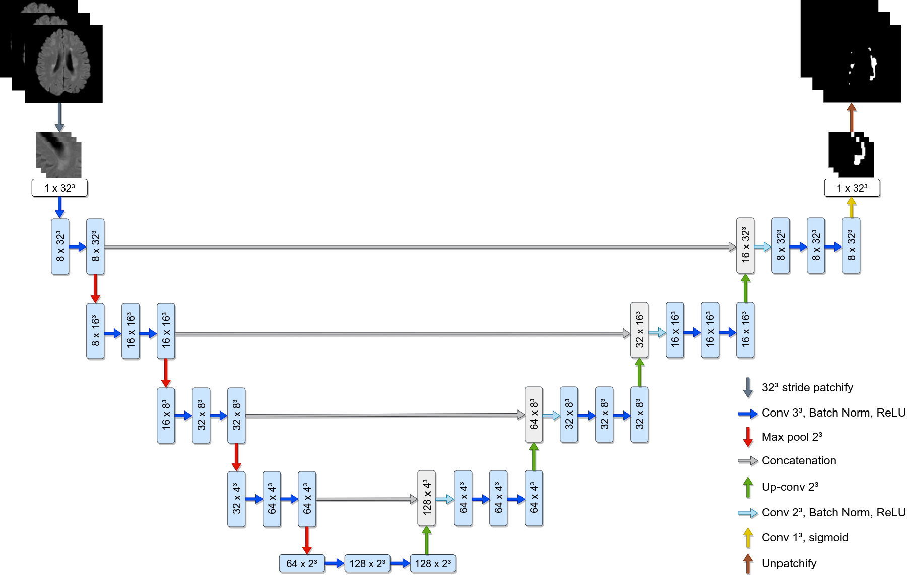

# U-NetPatch: Segmentation of multiple sclerosis in MRI with UNet and 3D patches.

## Abstract
Convolutional neural networks have revolutionized the task of medical image segmentation due to their outstanding performance and exceptional qualities, such as their ability to generalize and automatically extract relevant features, which is especially effective in the context of medical images. However, they face challenges when it comes to segmenting medical images from different sources, especially those with resolutions different from those of the training set. This work will be focused on overcoming these challenges and determining the best configuration and types of sampling patches as input to a convolutional neural network. In addition, a methodology for applying a magnetic resonance imaging (MRI) registration algorithm to a common space will be implemented. The performance of the segmentation models will be measured using evaluation metrics, such as Precision, Recall and DICE indices, which provide a better understanding of the effectiveness of the proposed approaches.
